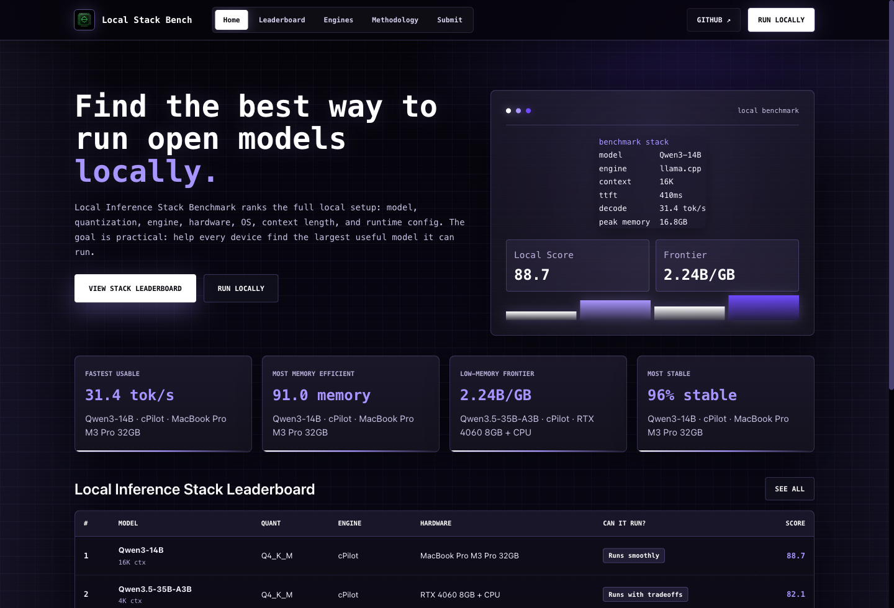

# Local Inference Stack Benchmark

Find the best way to run open models on local hardware.

## Website Preview

Temporary preview link: https://funny-tires-burn.loca.lt

> Note: this link is powered by a local tunnel for sharing the current preview build. It may change when the tunnel is restarted.



The homepage presents the benchmark as a full local inference stack leaderboard: model, quantization, engine, hardware, OS, context length, and runtime config are evaluated together. The current visual direction uses a black, white, and purple geek-style interface with high-contrast text, a terminal-inspired benchmark summary, and visible low-memory frontier metrics for local large-model deployment.

This benchmark ranks a complete inference stack:

```text
Model x Quantization x Inference Engine x Hardware x OS x Runtime Config
```

The goal is practical, not academic: help every user test their own device and discover the largest, fastest, most stable model setup that still fits their memory budget. It is especially useful for low-memory large-model deployment, where the winning stack is often not the biggest GPU or the highest raw tokens/s number, but the best balance of quantization, engine behavior, KV cache pressure, and quality retention.

## Why This Exists

Most public LLM leaderboards answer one of two questions:

1. How smart is the model?
2. How fast is a specific engine on a specific lab machine?

Local users usually need a different answer:

```text
Can my machine run this model, with this quantization, on this engine, at this context length, without falling apart?
```

This repository is built around that question. A benchmark row is only comparable when it records the full runtime tuple and workload shape. That means a single `tokens/s` number is never enough.

## What We Learned From Related Benchmarks

BenchLoop is useful because it evaluates real local workloads, not just vibes: speed, tool use, coding, extraction, instruction following, reasoning, and agent loops. The lesson we take from it is that real-world usefulness needs quality, speed, and reliability together.

KTransformers' benchmark guidance is useful because it is strict about reproducibility. A performance claim must include model checkpoint, precision, hardware, package version, launch command, input/output tokens, concurrency, and whether the metric is prefill, decode, or end-to-end.

This project combines those ideas for local inference stack selection:

- Keep the task easy for everyone to run.
- Record enough metadata for fair comparison.
- Make memory efficiency visible, not hidden behind raw speed.
- Preserve quality sanity checks so extreme compression does not win by breaking the model.

## Score

```text
Local Inference Score =
35% Speed
30% Memory Efficiency
20% Stability
15% Quality Retention
```

The public leaderboard also exposes raw metrics:

- TTFT
- Prefill tokens/s
- Decode tokens/s
- End-to-end latency
- Peak RAM
- Peak VRAM or unified memory
- OOM rate
- Stability success rate
- Quality retention score
- Can it run?
- Model density, shown as parameters per peak-memory GB

## Low-Memory Frontier

The default score is balanced. The low-memory frontier lens is more opinionated: it highlights stacks that run larger models with less peak memory while remaining stable and useful.

This is favorable to best-practice low-memory inference work:

- GGUF and other practical quantization formats
- Efficient engine runtime overhead
- Heterogeneous CPU/GPU placement
- Controlled KV cache growth
- Conservative context and batch settings
- Repeatable launch commands
- Quality retention checks after compression

Use the frontier view to discover promising setups, then inspect the raw metrics before making a deployment decision.

## Repository Layout

| Path | Purpose |
|---|---|
| `cli/` | Benchmark CLI, runner, stack schema, scoring, suites, submission/export logic |
| `site/` | React/Vite public benchmark site and stack leaderboard |
| `docs/` | Submission contract and product/spec notes |

## Run The CLI

Install from source:

```bash
cd cli
pipx install -e .
```

Run against Ollama:

```bash
benchloop run \
  --model qwen3:14b \
  --endpoint http://localhost:11434 \
  --provider ollama \
  --engine Ollama \
  --quantization Q4_K_M \
  --context-length 16384
```

Run against llama.cpp / llama-server:

```bash
benchloop run \
  --model Qwen3.6-35B-A3B-UD-IQ4_XS.gguf \
  --endpoint http://127.0.0.1:8080 \
  --provider openai_compat \
  --engine llama.cpp \
  --quantization IQ4_XS \
  --context-length 32768
```

Default stack suites:

```text
speed,memory,stability,quality_retention
```

Advanced behavior suites such as tool calling, coding, data extraction, instruction following, reasoning, and agent loops can still be used, but the main leaderboard treats them as optional analysis rather than the core stack score.

## Run The Site

```bash
cd site
npm install
npm run dev
```

Open:

```text
http://127.0.0.1:5181/
```

Production build:

```bash
npm run build
```

By default the site reads bundled seed data from:

```text
site/public/data/leaderboard.json
```

To use a hosted public ingest API, set:

```bash
VITE_PUBLIC_LEADERBOARD_API=https://your-api.example.com/leaderboard
```

## Public Pages

| Path | Purpose |
|---|---|
| `/` | Stack benchmark overview and low-memory positioning |
| `/leaderboard` | Local Inference Stack Leaderboard |
| `/engines` | Engine-level summary |
| `/models/:model` | Model-specific recommendations |
| `/hardware/:hardware` | Hardware-specific recommendations |
| `/methodology` | Scoring, privacy, and reproducibility rules |
| `/submit` | CLI submission instructions |
| `/docs` | Operator documentation |

## Required Metadata For Fair Comparison

Every serious result should record:

- Model id, checkpoint source, parameter size, quantization, and context length
- Engine name and version
- Provider mode and endpoint type
- CPU SKU, GPU SKU, GPU memory, system memory, OS
- Launch command and important runtime flags
- Input tokens, output tokens, concurrency, and batch behavior
- Whether the metric is prefill, decode, or end-to-end
- Peak CPU RAM and peak GPU VRAM or unified memory
- Failed loads, OOMs, timeouts, hangs, and crash behavior

If any of those fields differ, treat the result as a directional observation rather than a strict benchmark comparison.

## Privacy

Public submissions should include aggregate scores, hardware summaries, and suite summaries. They should exclude local file paths, raw prompts, raw completions, endpoint secrets, API keys, and private machine names by default.

Keep a run local:

```bash
export BENCHLOOP_NO_SUBMIT=1
```

## Status

This repository contains the first working Local Inference Stack Benchmark framework: CLI, seed data, public site, stack-oriented scoring, low-memory frontier sorting, and documentation. The bundled leaderboard data is preview data. Controlled hardware runs should replace it as the seed benchmark campaign starts.
